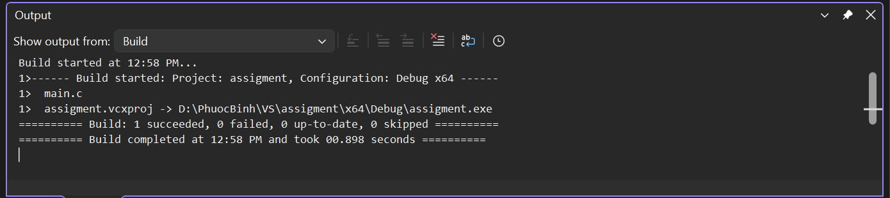
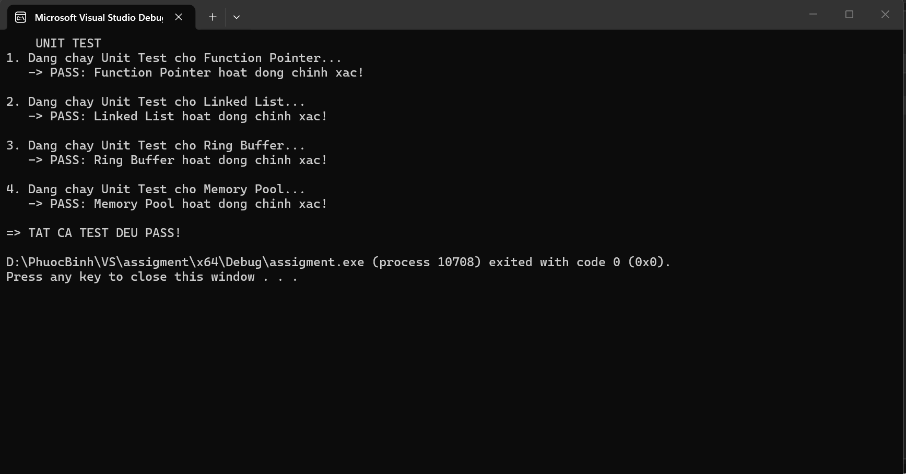

This repository provides standard C implementations of essential embedded software data structures, including Ring Buffers and Memory Pools.
Each module is paired with a dedicated suite of unit tests to ensure robust, leak-free, and reliable performance.
It serves as a highly practical foundation for developers looking to master low-level memory management and firmware testing.
## Unit test result: main.c
Below is the main function that runs all the unit tests:
```c
#include <stdio.h>
#include <assert.h>

#include "math_ops.h"
#include "linkedlist.h"
#include "ringbuffer.h"
#include "memorypool.h"

void test_function_pointer() {
    printf("1. Dang chay Unit Test cho Function Pointer...\n");
    int (*math_operations[4])(int, int) = { add, sub, mul, chia };

    assert(math_operations[0](10, 5) == 15);
    assert(math_operations[1](10, 5) == 5);
    assert(math_operations[2](10, 5) == 50);
    assert(math_operations[3](10, 5) == 2);
    printf("   -> PASS: Function Pointer hoat dong chinh xac!\n\n");
}

void test_linked_list() {
    printf("2. Dang chay Unit Test cho Linked List...\n");
    Node* my_list = NULL;

    insert_tail(&my_list, 100);
    insert_tail(&my_list, 200);
    insert_tail(&my_list, 300);

    assert(my_list->data == 100);
    assert(my_list->next->data == 200);
    assert(search_node(my_list, 200) == 1);
    assert(search_node(my_list, 999) == 0);

    printf("   -> PASS: Linked List hoat dong chinh xac!\n\n");
}

void test_ring_buffer() {
    printf("3. Dang chay Unit Test cho Ring Buffer...\n");
    RingBuffer rb;
    rb_init(&rb);
    int temp;

    assert(rb_is_empty(&rb) == 1);

    rb_push(&rb, 10);
    rb_push(&rb, 20);
    rb_push(&rb, 30);
    assert(rb.count == 3);

    rb_pop(&rb, &temp);
    assert(temp == 10);
    assert(rb.count == 2);

    rb_push(&rb, 40);
    rb_push(&rb, 50);
    rb_push(&rb, 60);
    assert(rb_is_full(&rb) == 1);

    printf("   -> PASS: Ring Buffer hoat dong chinh xac!\n\n");
}

void test_memory_pool() {
    printf("4. Dang chay Unit Test cho Memory Pool...\n");
    pool_init();

    void* p1 = pool_alloc();
    void* p2 = pool_alloc();
    void* p3 = pool_alloc();
    void* p4 = pool_alloc();
    void* p5 = pool_alloc();

    assert(p1 != NULL && p5 != NULL);

    void* p6 = pool_alloc();
    assert(p6 == NULL);

    pool_free(p3);

    void* p_new = pool_alloc();
    assert(p_new == p3);

    printf("   -> PASS: Memory Pool hoat dong chinh xac!\n\n");
}

int main() {
    printf("    UNIT TEST\n");

    test_function_pointer();
    test_linked_list();
    test_ring_buffer();
    test_memory_pool();

    printf("=> TAT CA TEST DEU PASS!\n");

    return 0;
}
```
## Build Result
## Build Result
## Build Result



**Expected Output:**

```text
    UNIT TEST 
1. Dang chay Unit Test cho Function Pointer...
   -> PASS: Function Pointer hoat dong chinh xac!

2. Dang chay Unit Test cho Linked List...
   -> PASS: Linked List hoat dong chinh xac!

3. Dang chay Unit Test cho Ring Buffer...
   -> PASS: Ring Buffer hoat dong chinh xac!

4. Dang chay Unit Test cho Memory Pool...
   -> PASS: Memory Pool hoat dong chinh xac!

=> TAT CA TEST DEU PASS!
```
